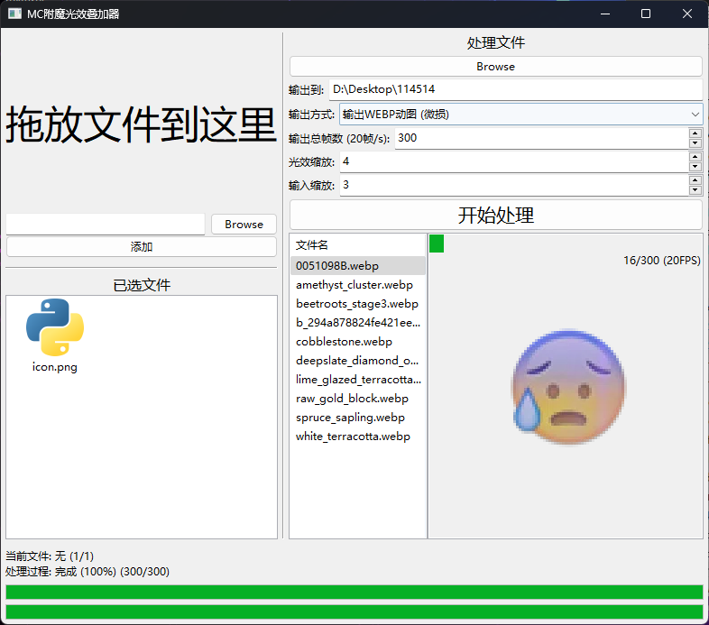

# _MCEnchantGlint_
- - - - - - - - - -
此软件使用了MC的游戏内资源 (enchanted_glint_item.png), 我不拥有此资源的版权。

我不会为该软件提供任何许可，仅供学习交流使用。

### 能干嘛
把一堆图片批量覆盖上MC的附魔光效, 多种输出方式 (帧、多种动图)！\
支持应用内预览！

### 如何使用
1. 下载项目压缩包
2. 解压至某地并在终端中打开
3. `pip install -r requirements.txt` 安装对应运行库
4. `python main.py`运行项目
5. 项目运行后可在GUI界面配置服务器地址

### 运行环境
1. Python 3.10.9

### 画廊

#### 软件界面 
